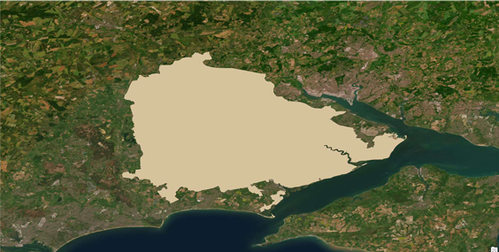
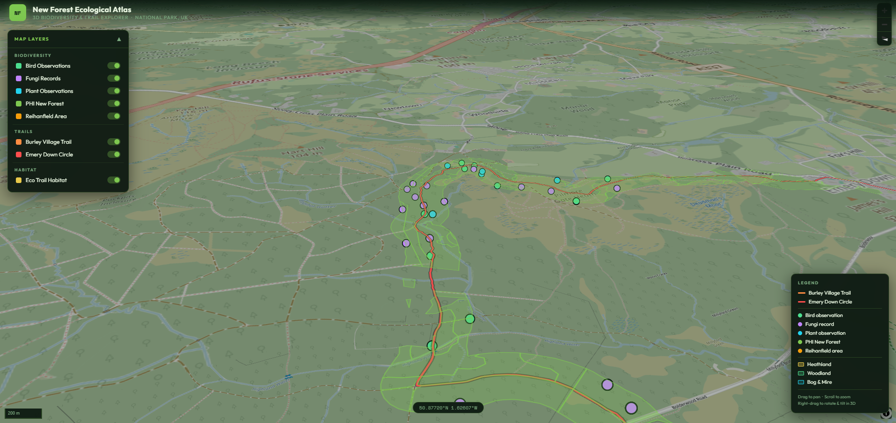

# Biodiversity Mapping & Eco-Trail Web App — New Forest

---

## Exploring Nature Through Data

What if a forest could explain itself?

While trekking through the New Forest, I found myself constantly switching between apps — trying to identify species, track routes, and understand terrain. What should have been a simple, immersive experience became fragmented and dependent on internet access.

This project began as a response to that frustration — to unify environmental data into a single, intuitive system.

---

## From Observation to Idea

  

Instead of treating GIS as a backend tool, this project reimagines it as an interface for exploration.

The goal was to create a system where:

* Trails
* Biodiversity
* Learning

exist together in one place.

---

## Building the Spatial Foundation

The project begins with spatial analysis in ArcGIS Pro and Python workflows.

  

### Data Sources

* Field observations
* Remote sensing datasets
* Biodiversity records

### Processing (ArcPy + GeoPandas)

* Data cleaning and standardisation
* Biodiversity layer creation
* Terrain and slope integration
* GeoJSON preparation for web

---

## Modelling Ecological Value

A weighted biodiversity model was developed:

**Index = (SpeciesDensity × 0.6) + (HabitatRarity × 0.4)**

This classifies areas from low to very high ecological value, transforming raw data into spatial insight.

---

## Eco-Trail Suitability

  

By combining biodiversity and terrain, the system identifies routes that:

* Maximise ecological richness
* Minimise environmental impact
* Support accessible exploration

---

## Interactive Web Application

  

The spatial model is translated into an interactive WebGIS platform.

### Built With

* Leaflet.js
* Mapbox
* HTML, CSS, JavaScript

### Features

* Dynamic layer toggling
* Biodiversity exploration
* Trail insights (distance, difficulty, elevation)

Leaflet enables rendering of GeoJSON layers and real-time interaction.

---

## Addressing Real-World Constraints

The original problem included internet dependency.

Future improvements:

* Offline map support
* Local data storage
* Progressive Web App (PWA)

---

## From Project to System

This workflow is scalable.

By replacing input datasets, it can be applied to:

* National parks
* Forest ecosystems
* Urban green spaces

---

## Project Access

GitHub Repository:
https://github.com/work4estolondon-hash/newforest-eco-trail-webapp

---

## Author

Muhammed Muhsin CK
Environmental GIS | Spatial Analysis | Sustainability | Web Mapping
